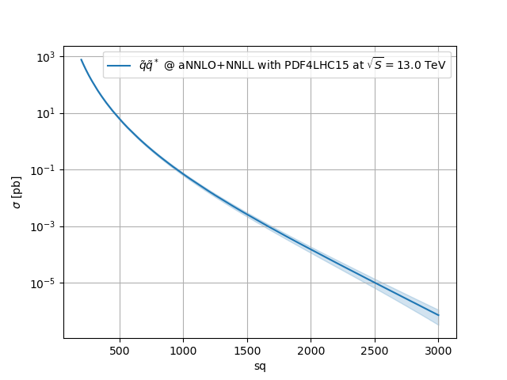

# HEPi

Python interface for gluing together several HEP programs (e.g. from HEPForge <https://www.hepforge.org/>).

[![PyPI version][pypi image]][pypi link]

[](https://doi.org/10.5281/zenodo.8430837)
[](https://binderhub.ssl-hep.org/v2/gh/APN-Pucky/HEPi/binder?labpath=docs%2Fsource%2Fexamples%2Fdemo_00_resummino.ipynb)
[](https://mybinder.org/v2/gh/APN-Pucky/HEPi/binder?labpath=docs%2Fsource%2Fexamples%2Fdemo_00_resummino.ipynb)
[Unstable][doc test]
[![test][a t image]][a t link]
[![Coverage Status][c t i]][c t l]
[![Codacy Badge][cc c i]][cc c l]
[![Codacy Badge][cc q i]][cc q l]
[![Documentation][rtd t i]][rtd t l]


## Goals

The goal of this project is to provide a simple and easy to use interface to common high-energy-physics tools (currently mainly SUSY related Tools).
Parameter scans and plotting is also included.
Different tools should just be plugged in and out as desired (i.e. generate a SUSY spectrum before running a scan with MadGraph).

## Idea

First generate a list of interested parameter points i.e. mass 100 to 1000 GeV squark.
Then if you also want to scan over the gluino mass just ask for a scan over previous list, and you get a 2d scan.
After generating all parameters they can be used to directly run the codes (in parallel or sequential) or just generate the input file for distribution across several clusters.
The results then can be imported again and plotted nicely.

## Realisation
In the working directory you have an `input` and `output` folder. The input would typically contain the baseline slha file.
The `output` will contain the produced scripts to execute the tools.
To avoid file collisions the files in the output folder correspond to a hashed value of all input parameters.
If a result already exists hepi won't rerun the tool.

## Documentation

For more details on the usage of different tools, called runners, check the respective documentation.

-   <https://hepi.readthedocs.io/en/latest/>

## Versions

### Stable

```sh
pip install hepi[opt] [--user] [--upgrade]
```

`[opt]` can be omitted to avoid optional dependencies (ie. lhapdf).


## HEPi-fast
HEPi-fast interpolates grids similarly to [(n)nll-fast](https://www.uni-muenster.de/Physik.TP/~akule_01/nnllfast/doku.php?id=nllfast) but also for [Resummino](https://resummino.hepforge.org).  
They are given as JSON files as for the CERN SUSY wiki in [xsec](https://github.com/fuenfundachtzig/xsec).
A default set of grids is in the source folder `hepi/data/json/`.
HEPi can be used to generate such JSON files for convenient reloading of the data.
Just enter a mass point and the cross sections are returned:

```
$ hepi-fast --help
[...]
$ hepi-fast 13600_sleptons_1000011_-1000011_NNLL.json
547
0 547.0 0.0003595877111213834 2.524930051307783e-05 -2.520906052972218e-05 1.7378151961260709e-06 -9.940418204744763e-07 2.5189449167488203e-05 -2.5189449167488203e-05
988
0 988.0 1.431846191827644e-05 2.44205862446039e-06 -2.4413596449724868e-06 6.14033144355307e-08 -2.0494188119845572e-08 2.4412735921747426e-06 -2.4412735921747426e-06
547
0 547.0 0.00035958771606265744 -2.5249300930888148e-05 2.5209060862746587e-05 -1.737815390324732e-06 9.940418677810902e-07 -2.5189449417355387e-05 2.5189449417355387e-05
988
0 988.0 1.4318461918225316e-05 -2.4420586244508355e-06 2.441359644963803e-06 -6.140331443352323e-08 2.0494188119359375e-08 -2.4412735921671295e-06 2.4412735921671295e-06
[...]
```

Above shows slepton-pair cross section for requested 547 and 988 GeV mass at aNNLO+NNLL.
The order of the output is 
```
ID | Central value | error up | error down | error scale up | error scale down | error pdf up | error pdf down
```
If you just want to look at a quick plot of the interpolation run
```
$ hepi-fast pp13_squark_NNLO+NNLL.json --plot
```
for something like




[doc stable]: https://apn-pucky.github.io/HEPi/index.html
[doc test]: https://apn-pucky.github.io/HEPi/test/index.html

[pypi image]: https://badge.fury.io/py/hepi.svg
[pypi link]: https://pypi.org/project/hepi/

[a s image]: https://github.com/APN-Pucky/HEPi/actions/workflows/stable.yml/badge.svg
[a s link]: https://github.com/APN-Pucky/HEPi/actions/workflows/stable.yml
[a t link]: https://github.com/APN-Pucky/HEPi/actions/workflows/unstable.yml
[a t image]: https://github.com/APN-Pucky/HEPi/actions/workflows/unstable.yml/badge.svg

[cc s q i]: https://app.codacy.com/project/badge/Grade/ef07b792a0f84f2eb1d7ebe07ae9e639?branch=stable
[cc s q l]: https://www.codacy.com/gh/APN-Pucky/HEPi/dashboard?utm_source=github.com&amp;utm_medium=referral&amp;utm_content=APN-Pucky/HEPi&amp;utm_campaign=Badge_Grade?branch=stable
[cc s c i]: https://app.codacy.com/project/badge/Coverage/ef07b792a0f84f2eb1d7ebe07ae9e639?branch=stable
[cc s c l]: https://www.codacy.com/gh/APN-Pucky/HEPi/dashboard?utm_source=github.com&utm_medium=referral&utm_content=APN-Pucky/HEPi&utm_campaign=Badge_Coverage?branch=stable

[cc q i]: https://app.codacy.com/project/badge/Grade/ef07b792a0f84f2eb1d7ebe07ae9e639
[cc q l]: https://www.codacy.com/gh/APN-Pucky/HEPi/dashboard?utm_source=github.com&amp;utm_medium=referral&amp;utm_content=APN-Pucky/HEPi&amp;utm_campaign=Badge_Grade
[cc c i]: https://app.codacy.com/project/badge/Coverage/ef07b792a0f84f2eb1d7ebe07ae9e639
[cc c l]: https://www.codacy.com/gh/APN-Pucky/HEPi/dashboard?utm_source=github.com&utm_medium=referral&utm_content=APN-Pucky/HEPi&utm_campaign=Badge_Coverage

[c s i]: https://coveralls.io/repos/github/APN-Pucky/HEPi/badge.svg?branch=stable
[c s l]: https://coveralls.io/github/APN-Pucky/HEPi?branch=stable
[c t l]: https://coveralls.io/github/APN-Pucky/HEPi?branch=master
[c t i]: https://coveralls.io/repos/github/APN-Pucky/HEPi/badge.svg?branch=master

[rtd s i]: https://readthedocs.org/projects/hepi/badge/?version=stable
[rtd s l]: https://hepi.readthedocs.io/en/stable/?badge=stable
[rtd t i]: https://readthedocs.org/projects/hepi/badge/?version=latest
[rtd t l]: https://hepi.readthedocs.io/en/latest/?badge=latest


